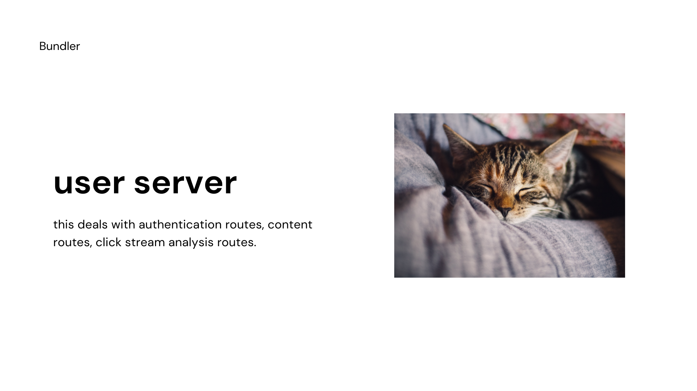

# User Server

This server deals with user authentication and content routes.

The API mockups is provided here  - [Postmain Collection](https://drive.google.com/file/d/1gagH9oDhpV2gY48SPlBYBL9LOL4f75g6/view?usp=sharing)

###### Authentication Endpoints

```
http://localhost:5000/api/v1/auth/signup
http://localhost:5000/api/v1/auth/login
http://localhost:5000/api/v1/auth/logout
http://localhost:5000/api/v1/auth/new-access-token
```

###### Static Endpoints

This endpoint is to get the professions for the frontend. The keys "search","agriculture" and unique keys, title is what to display on frontend along with tags.

```
http://localhost:5000/api/v1/statics/professions

{
  professions: {
    agriculture: {
      title: "Agriculture, Food and Natural Resources",
      tags: [
        "Agriculture",
        "Farming",
        "Food",
        "Sustainability",
        "Technology",
        "Environment",
        "International Development",
        "Africa",
        "Food Security",
        "Agricultura",
      ],
    },
    architecture: {
      title: "Architecture and Construction",
      tags: [
        "Architecture",
        "Construction",
        "Design",
        "Engineering",
        "Building",
        "Bim",
        "Interior Design",
        "Real Estate",
        "Construction Industry",
        "Sustainability",
      ],
    },
    education: {
      title: "Education and Training",
      tags: [
        "Education",
        "Teaching",
        "Learning",
        "Schools",
        "Technology",
        "Life Lessons",
        "Education Reform",
        "Higher Education",
        "CollegeLife",
      ],
    },
    business: {
      title: "Business Management and Administration",
      tags: [
        "Business Management",
        "Business",
        "Business Strategy",
        "Leadership",
        "Entrepreneurship",
        "Startup",
        "Management",
        "Product Management",
        "Project Management",
        "Productivity",
      ],
    },
    science: {
      title: "Science, Technology, Engineering and Mathematics",
      tags: [
        "Science And Engineering",
        "Education",
        "Scholarship",
        "Academic City",
        "Data Science",
        "Engineering",
        "Science",
        "Machine Learning",
        "Web development",
        "Python",
        "Javascript",
        "React",
        "DevOps",
        "Android",
        "Kotlin",
        "flutter",
        "ktor",
        "Nodejs",
        "Backend",
      ],
    },
    marketing: {
      title: "Marketing, Sales and Service",
      tags: [
        "Marketing",
        "Business",
        "Social Media",
        "Startup",
        "Entrepreneurship",
        "Digital Marketing",
        "Content Marketing",
        "Social Media Marketing",
        "Writing",
        "Advertising",
      ],
    },
  },
};

```

###### Content Endpoints

```
http://localhost:5000/api/v1/content/feed?type=home
http://localhost:5000/api/v1/content/feed?type=keyword&tags=react
http://localhost:5000/api/v1/content/keywords
http://localhost:5000/api/v1/content/keywords?previous=react
```

###### Analytics Endpoints

```
http://localhost:5000/api/v1/analytics/click
http://localhost:5000/api/v1/analytics/view
http://localhost:5000/api/v1/analytics/session
```


#### How to get started?

This server runs at port 5000. (Do not change the respective ports of NOF servers while testing)

```
git clone https://github.com/N-O-F/user-server.git
cd user-server
npm i
npm run startDev
```
